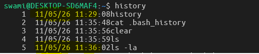

# The History Command

The history of commands executed by each user is stored inside the file called .bash_history.

`cat .bash_history`

- The number of command stored in the history is controlled by an environment variable called `HISTFILESIZE`
- check out the History File Size
  `echo $HISTFILESIZE`
  
- Here the HISTFILESIZE is 2000, means it can store or saves upto `2000` commands

| Variable       | Controls                                    | Location                 | Meaning                                           |
| -------------- | ------------------------------------------- | ------------------------ | ------------------------------------------------- |
| `HISTSIZE`     | Commands stored in current shell memory     | RAM/session              | How many commands your current terminal remembers |
| `HISTFILESIZE` | Commands stored permanently in history file | Disk (`~/.bash_history`) | How many commands are saved to the history file   |

### Easy Real-World Analogy

| Concept        | Analogy                     |
| -------------- | --------------------------- |
| `HISTSIZE`     | Whiteboard in your room     |
| `HISTFILESIZE` | Notebook stored permanently |

### The `history` command will show you all the executed commands.

- The command with the most recent command will be shown with highest number and command with most old one is with lowest number.

- You can also refer to a command from a certain number of lines, back in the bash history.
  For example, !-7 would run the last 7th command.
  Or just give a reference of the command, like you want to run the last command related with ping command then just type `!ping` then last comamnd related to the `ping` command would be executed.

- The HISTCONTROL variable is developer's friendly and which is mostly used when you do not want to store your executed command into the history as well as in the .bash_history file.

- If you put `space` before any command then that command would not be stored into the history.

- To avoid duplicate commands history we use `ignoreboth` into the HISTCONTROL variable.
- which will then removes duplicate entries of same command into the history.

---

### To record the Date and Time for each command executed in the History.

- We use `HISTTIMEFORMAT` variable.
- HISTTIMEFORMAT="%d/%m/%y %T"

- Example:
  
- Look at the Date and Timestamp for each command in history.

- To save it permenantly for every session then use following command.

`echo 'HISTTIMEFORMAT="%d/%m/%y %T"' >> .bashrc`

---

##########################

## Commands

##########################

### 1. showing the history

history

### 2. removing a line (ex: 100) from the history

history -d 100

### 3. removing the entire history

history -c

### 4. printing the no. of commands saved in the history file (~/.bash_history)

echo $HISTFILESIZE

### 5. printing the no. of history commands saved in the memory

echo $HISTSIZE

### 6. Rerunning the last command from the history

!!

### 7. Running a specific command from the history (ex: the 20th command)

!20

### 8. Running the last nth (10th) command from the history

!-10

### 9. Running the last command starting with abc

!abc

### 10. Printing the last command starting with abc

!abc:p

### 11. Reverse searching into the history

CTRL + R

### 12. Recording the date and time of each command in the history

HISTTIMEFORMAT="%d/%m/%y %T"

### 13. Making it persistent after reboot

echo "HISTTIMEFORMAT=\"%d/%m/%y %T\"" >> ~/.bashrc

### OR

echo 'HISTTIMEFORMAT="%d/%m/%y %T"' >> ~/.bashrc

---
