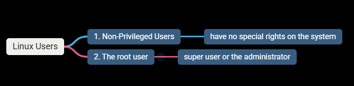
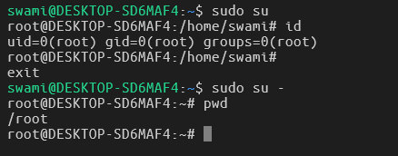
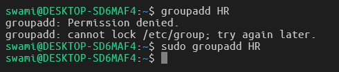
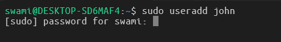
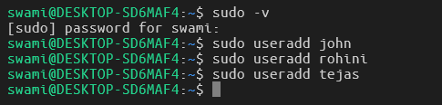
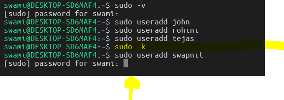
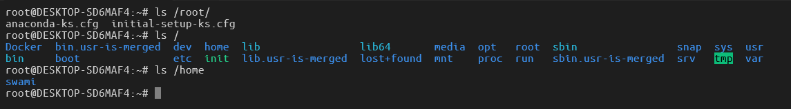

# Getting Root Access

### On Linux, there are 2 categories of users:

- Root account is the most privileged on the system and has absolute power over it.
- Root only exist on any Linux system and there's only one.
- It's not recommended to use `root` for ordinary task.
  When root permissions are needed you simply become root only to perform that particular administrative task.

---

### 1. To become root in the terminal, execute:

`sudo su`

- `sudo` stands for super user do.
- `su` stands for substitute user.

### A second way to run commands as root without logging into the root account, by using the `sudo` command.

- Observe the above commands properly that the normal user is not able to add the new group and while typing the command groupadd will get permission denied error.
- When a non-privileged user uses the `sudo` command then there would be no error and command runs successfully.
- The new group will be added as `HR`

---

# The SUPERUSER CACHE MECHANISM.

- When you want to user super user privileges for some certain administrative tasks, you will be asked for the password every time.

for example:

1. Adding a new user
   > `sudo useradd john`

- It will ask you a root password before adding the new user as follows:
  

- To avoid this, everytime you don't want to put the password for all administrative based tasks, you just have to add following temporary command as:

  > `sudo -v`
  > This command will stop asking the user to enter the root password everytime. You need to put the password only for one-time.
  > This will open the `lock` for temporary purpose until the session ends.
  > 

- This is one time activity for the entire session.
- Now we will check that after executing the command successfully the user will not be asked for the command anymore.
  

### To lock the things back again you need to close the lock of the above command and for each admnistrative task the user must be add the password and it is good for the security purpose. Use the following command.

> `sudo -k` THIS COMMAND WILL THEN LOCK THE PRIVILEGES BACK AND USER WILL BE ASKED FOR THE PASSWORD AGAIN FOR EACH ADMINISTRATIVE TASKS.
> for example:
> 
> here in above image, after adding `sudo -k` command, notice that for new user add named swapnil, the sudo is asking for the password to be enter to complete the task.

- The home directory of the root user is inside the root account and it will be resided at `/root/` location.
- Home directories for all other Users, rather than the root User are created in the `/home` by default.
  

- > the user root home directory: /root/
- > the root as a main directory: /
- > the other user's home directory: /home/

---

##########################

## Running commands as root (sudo, su)

##########################

### 1. running a command as root (only users that belong to sudo group [Ubuntu] or wheel [CentOS])

sudo command

### 2. becoming root temporarily in the terminal

sudo su # => enter the user's password

### 3. setting the root password

sudo passwd root

### 4. changing a user's password

passwd username

### 5. becoming root temporarily in the terminal

su # => enter the root password
