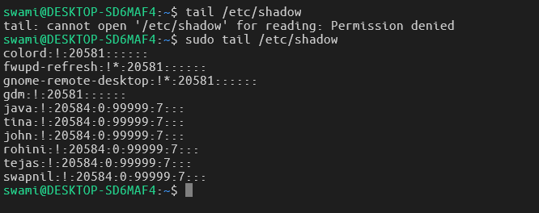
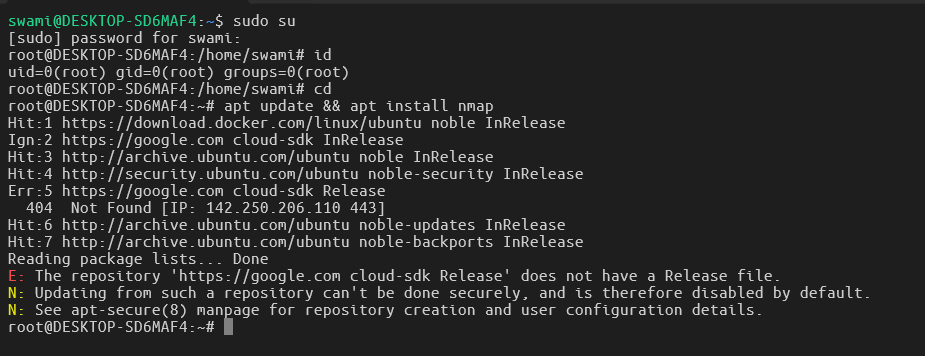
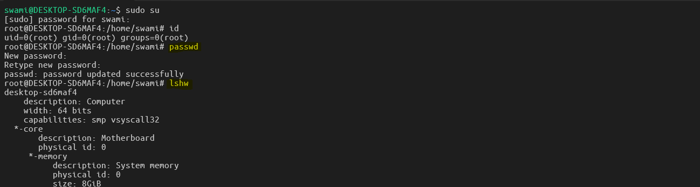
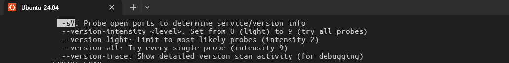
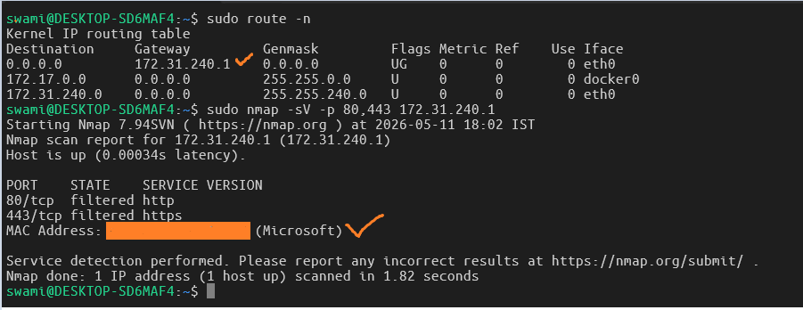
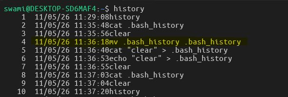
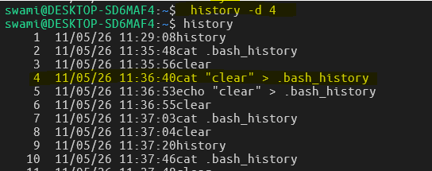
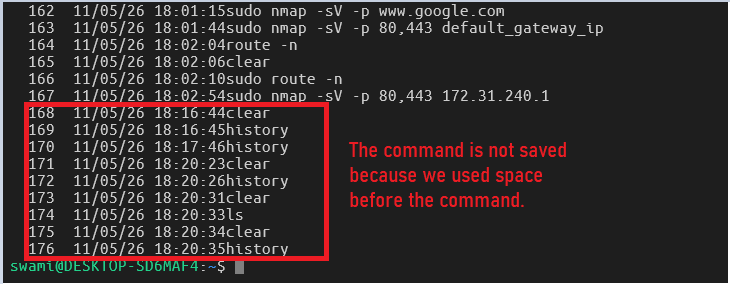

Challenge #1

- Run the following command both as a non-privileged user and as root: tail /etc/shadow
  Use the TAB key for auto-completion.

---

The Answer:

---

Challenge #2

- Become root temporarily in a terminal.
- Run the following command as root: apt update && apt install nmap
- Logout root from the terminal using a keyboard shortcut
  

---

Challenge #3

- Change (set) the root password
- Become root in a terminal by running the su command
- Run as root the following command: lshw

---

Challenge #4

- Consider the nmap program installed in a previous challenge. Open its man page and search for the option -sV
- Run as root: nmap -sV -p 80 www.example.com
- Find the IP address of your Default Gateway running route -n and then run as root: nmap -sV -p 80,443 default_gateway_ip (Example: nmap -sV -p 80,443 192.168.0.1)
  
  

---

Challenge #5

- Display the user’s history
- Remove line no. 4 from the history
- Run a command without being recorded in history. Check that it wasn’t saved in the shell history.
- Remove the entire history.

> 
> 
> 

> Note: To do not store what we have done in the history then we must use `history -c` command.
