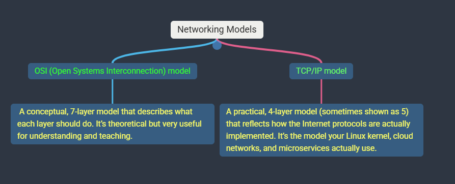
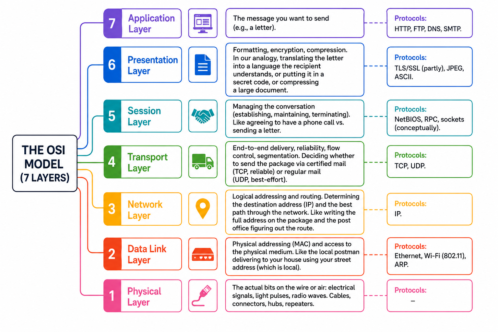
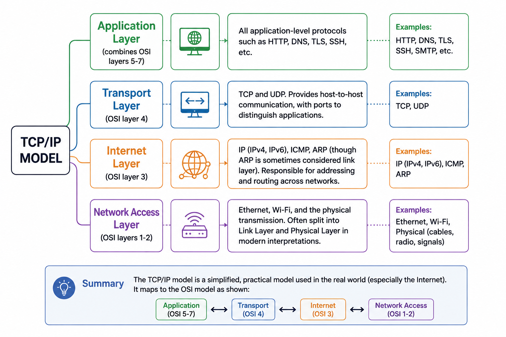
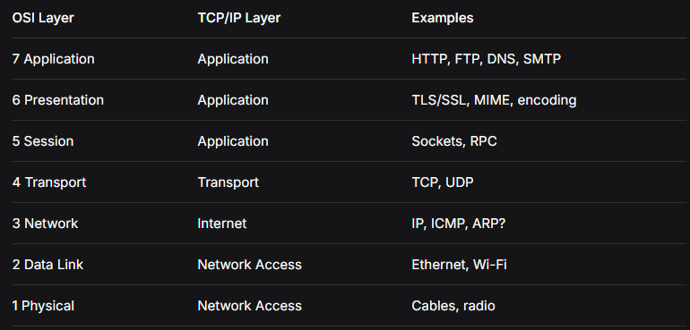

# `Why Do We Need Networking Models?`

Imagine you’re building a modern web application. Your frontend runs in a browser, your backend runs in containers on Kubernetes, and your database lives in a managed cloud service. All these components must communicate. But how? They run on different machines, different operating systems, possibly different continents. Networking is complex: electrical signals, error detection, addressing, routing, sessions, encryption, compression, application protocols… The list is endless.

### `Networking models exist to break this complexity into manageable, standardized layers.`

#### Each layer has a specific job, and layers communicate with `adjacent layers` through well-defined interfaces. This allows:

- `Independent evolution` : you can upgrade your Wi-Fi hardware without changing your HTTP code.
- `Interoperability`: a Linux server can talk to a Windows server because they follow the same layered protocols.
- `Troubleshooting`: if something breaks, you can isolate which layer is failing.

### There are Two Primary Models.

---

## THE `OSI` MODEL (7 LAYERS)

#### `Think of it like sending a physical package via a courier service`:

### Encapsulation and Decapsulation

- When data travels down the stack (from application to physical), each layer adds its own header (and sometimes trailer) – this is `encapsulation`.
- At the receiving end, the process reverses `decapsulation`.
- This is like putting your letter into an envelope, then into a larger envelope with the full address, then into a mail bag, then onto a truck.

#### `Real-world Linux example`: When you run curl `https://example.com`, the data goes:

- `Application (HTTP request)` → `Transport (TCP segment with source/dest port)` → `Network (IP packet with source/dest IP)` → `Data Link (Ethernet frame with source/dest MAC)` → `Physical (bits on the wire)`.

#### `The kernel handles layers 3 and 4` (IP and TCP/UDP) and passes to the NIC driver for layer 2 and physical.

---

## THE `TCP/IP` MODEL (4 LAYERS)

---

### `Mapping OSI to TCP/IP protocol`.

- Notice that the `TCP/IP model collapses the top three OSI layers into one “Application” layer` because in practice, session and presentation concerns are often handled within `the application or by libraries` (like TLS libraries), not as separate network layers.

---

### WHY Two Models?

- `OSI is a reference model`: it’s prescriptive, defines clear boundaries, and is great for teaching and for understanding what each function is. However, it was developed before the protocols we use today, and its strict layering doesn’t always match reality (e.g., some protocols cross layers).
- `TCP/IP is a descriptive model`: it describes how the Internet protocols actually work. It’s simpler and aligns with real implementations. It’s the model you’ll use when debugging with `tcpdump`, `ss`, `ip`, `netstat`, etc.

#### Note: As a senior engineer, you should be fluent in both, but reason with `TCP/IP in production, and use OSI as a mental checklist for troubleshooting` (e.g., “Is this a layer 2 or layer 3 problem?”)

---

## How These Models Show Up in Production

1. `Linux networking stack`: The kernel implements the TCP/IP model. The socket API sits at the boundary between `application and transport`. The `ip` command manages the `Internet layer (routes, IP addresses)`. - The `ethtool and ip` link manage the `Network Access` layer (NICs, MAC addresses, VLANs).

2. `Cloud VPCs (AWS, GCP, Azure)`: A VPC is a virtual network. `Subnets are Layer 3 concepts (IP ranges)`. `Security groups and NACLs operate at Layer 3/4 (IP and ports)`. Routing tables `direct traffic between subnets and to the internet (Layer 3)`. The underlying physical networking (Layer 1/2) is abstracted away.

3. `Kubernetes networking`: `Pods get IP addresses (Layer 3)`, and CNI plugins (Calico, Cilium, Flannel) create overlay or routed networks. `Services provide stable IPs and load balancing (Layer 3/4)`. `Ingress controllers handle HTTP routing (Layer 7)`. Network policies can filter at Layer 3/4 (IP/port) or `Layer 7 (HTTP paths) depending on the CNI`.

4. `Microservices` : Service-to-service communication often uses `HTTP/gRPC (Layer 7) over TCP (Layer 4)`. Service meshes like `Istio operate at Layer 7` for traffic management, while mTLS provides encryption (Presentation-ish but considered Application in TCP/IP). `Load balancers can operate at Layer 4` (TCP/UDP) or `Layer 7 (HTTP)`.

5. `Troubleshooting`:
   If a service can’t reach another, you might check:

- `Application layer`: is the request well-formed? (curl, logs).
- `Transport`: is the port open? (nc -vz host port).
- `Internet`: can you ping? (ICMP) or `traceroute` to see routing.
- `Network Access`: is the `ARP` entry correct? (ip neigh), is the `interface` up? (ip link)

---

### Senior-Level Interview Expectations

- Explain the models without memorizing mnemonics, but by relating them to real packets and system behavior.

- Map a problem to the correct layer quickly: e.g., “The connection times out; is it a firewall (L3/4), a routing issue (L3), or a DNS problem (L7)?”

- Understand the implications of layering: e.g., how `TLS fits into the models`, `why HTTP/2 is still considered application layer` but uses binary framing, why `QUIC moves transport to UDP` but still provides reliability at the application layer.

- Discuss how networking models influence design decisions: e.g., choosing between a `Layer 4` load balancer (more performant, less features) and a `Layer 7` load balancer (can route based on URL, do TLS termination, etc.)

- Debug using tools that operate at specific layers: `tcpdump (L2-L4), strace (L4-L7 syscalls), curl -v (L7)`, etc.

---

### `Common Pitfalls / Misconceptions`

#### `Misconception-1` : TCP/IP has only 4 layers, so the OSI session layer is irrelevant

- In practice, session management is handled by the application (cookies, tokens) or by TCP itself (connection state). It’s not a separate network layer.

#### `Misconception-2` : TLS is layer 6

- In the OSI model, `TLS` is often placed at `layer 6`(`presentation`) because it `provides encryption`, but in the TCP/IP model it’s part of the `application layer` (sits on top of TCP). Modern discussions often treat `TLS as a sub-layer of the application layer`.

#### `Misconception-3` : ARP is layer 3.

- `ARP resolves IP to MAC`, bridging `layer 3 and 2`; it’s often considered a `layer 2 protocol` because it operates within a local network segment. Different sources place it differently, but understand its function.

#### `Misconception-4` : The OSI model is obsolete

- It’s still valuable for conceptual understanding and for vendor-neutral discussions, especially in security contexts.

---

---

### Quiz

#### Question 1:

`Qu:` A developer says, “Our service can’t connect to the database. The connection times out.” As a senior engineer, walk through which layers of the TCP/IP model you would investigate, in order, and what tools you would use at each step.

`Answer`:

- Service-to-service communication does not `happen only at layer 7`. It involves the whole stack: the application (L7) sends data, which is encapsulated down through transport (L4), network (L3), data link (L2), and physical (L1). The `connection timeout means that the client did not receive a SYN-ACK (if TCP) within the expected time`, so the `issue could be at any layer` that prevents the packet from reaching the destination or the response from returning.

- Your instinct to check reachability is correct, but the order and tools should be more systematic. As a senior, you should start from the highest layer and work down (or sometimes from the lowest layer up depending on context). Here’s a more structured approach:

- `Application Layer (L7)` – Is the database service name resolving correctly? Is the application using the right connection string?
- `Check DNS resolution`: `nslookup db.internal, dig db.internal`. Check if the app’s configuration points to the correct host and port. Also verify that the database service is actually listening on that port from the app’s perspective (maybe it’s a different port).
- `Transport Layer (L4)` – Is the TCP port open and accepting connections? Use `nc -vz <db_host> <port>` or `telnet <db_host> <port>`. If this fails, the port may be closed, `firewalled, or the service isn’t listening`. Check with `ss -tlnp` or `netstat -tlnp` on the `database host` to see if the process is bound to the expected port.
- `Network Layer (L3)` – Is the IP reachable? `ping uses ICMP`, which may be blocked by firewalls even if TCP is allowed. So ping alone is not conclusive. Better to `use traceroute (or tracepath)` to see where packets stop. Also check routing tables: `ip route`, `ip rule`. If the two services are in different `subnets/VPCs`, maybe a route is missing.
- `Data Link/Physical (L2/L1)` – Rarely an issue in cloud/K8s, but if it’s a `bare-metal or VM environment`, check interface status, VLANs, etc.
- The timeout specifically suggests that `SYN packets are being sent but no SYN-ACK is received`. This could be because:

- The destination host is down or unreachable (network layer). (L3)
- A firewall is silently dropping packets (network/transport layer). (L3/L4)
- The service is not listening on that port (transport layer). (L4)
- The route to the destination is asymmetric or broken.

### Senior-level tip: Always try to reproduce the connection attempt with a tool that uses the same protocol as the application (TCP, not ICMP). For databases, you might use nc, telnet, or a database client like psql/mysql with a short timeout.

---

#### Question 2:

Explain the difference between a Layer 4 load balancer and a Layer 7 load balancer. Which OSI layers do they correspond to? Give an example of when you would choose one over the other.

Answer:

- `Layer 4 load balancer operates at the Transport Layer (OSI L4)`. It makes forwarding decisions based on `IP address and TCP/UDP port`. It does not inspect the payload. `It is like a very fast traffic cop that just looks at the envelope (destination IP and port) and forwards to a backend`. It can be used for any TCP/UDP application, not just internal. For example, a classic AWS Network Load Balancer (NLB) can load balance external traffic to web servers, or internal traffic to databases. It is generally more `performant because it does less processing.`
- `Layer 7 load balancer operates at the Application Layer (OSI L7)`. It can inspect the content of the request `(HTTP headers, URL path, cookies, etc.)` and `make routing decisions based on that`. It can do `SSL termination, content-based routing, caching, rate limiting, etc`. It is `“smarter” but also more resource-intensive`. It can be used for both `internal and external` traffic. For example, an AWS Application Load Balancer (ALB) can route requests to different microservices based on `URL path (/api vs /admin)`. In Kubernetes, an `Ingress controller is an L7 load balancer`.
- `Key difference`: `L4 sees only IPs and ports`; `L7 sees the application data`. Choose `L4` when `you need high throughput and simple distribution` (e.g., load balancing `database replicas, non-HTTP protocols like SMTP, or when you don’t need to inspect content`). Choose L7 when `you need advanced routing, TLS termination, or observability at the HTTP level`.

`Misconception`: L4 is for internal and L7 for external is not accurate – both can be used in either context. The decision is based on the `protocol and the features required`.

---

#### Question 3:

`Qu:` When you run curl https://api.example.com, describe the path of the data through the TCP/IP layers on the client side, including what headers are added at each layer (you can use specific protocols like HTTP, TLS, TCP, IP, Ethernet). What happens at the server side?

`Answer`:
Let’s trace the full path, including HTTPS (which uses TLS):

- `Application Layer (TCP/IP)` – curl constructs an HTTP GET request. Since the URL starts with `https, it first initiates a TLS handshake` (which is also considered part of the Application layer in TCP/IP, or Presentation/Session in OSI). `TLS provides encryption, authentication, and integrity`. The HTTP request is then encrypted inside TLS records.
  So the data at this layer is: `TLS Record { Encrypted HTTP Request }.`
- `Transport Layer (L4)` – The `TLS data is passed to TCP`. TCP adds a TCP header containing `source port (ephemeral, e.g., 54321) and destination port (443 for HTTPS), sequence numbers, flags, etc`. The unit is now a `TCP segment`.
- `Network Layer (L3)` – The `TCP segment is passed to IP`. IP adds an `IP header with source IP (your machine’s IP) and destination IP (resolved from DNS, e.g., 93.184.216.34)`. The unit is now an `IP packet`.
- `Data Link Layer (L2)` – The IP packet is passed to the network interface (e.g., Ethernet). Ethernet `adds a frame header with` `source MAC address (your NIC’s MAC) and destination MAC address (the MAC of the next hop, which is usually your default gateway, determined by ARP). It also adds a Frame Check Sequence (FCS) trailer for error detection`. The unit is now an `Ethernet frame`.
- `Physical Layer (L1)` – The frame is converted to `electrical/optical` signals and transmitted.
- `At the server side, the reverse happens`: the Ethernet frame is checked, the IP packet is validated, the `TCP segment is reassembled (and ACKs sent)`, the TLS records are decrypted, and the `HTTP request is delivered to the web server`.

#### `Important Note`: Notice that the `destination MAC is not the final server’s MAC unless the server is on the same local network`. In most cases, the frame goes to the default gateway, which routes based on IP. Also, `DNS resolution occurs before the TCP connection`, and it’s a separate `application-layer` protocol (usually UDP port 53). Your curl command first resolves `api.example.com` to an `IP`.

#### Question 4:

Why is the TCP/IP model sometimes shown with 5 layers instead of 4? What is the extra layer, and why does it matter?

Answer:
The 4-layer TCP/IP model (as originally defined) combines the OSI Data Link and Physical layers into a single “Network Access” or “Link” layer. However, many modern textbooks and practical discussions split that into Data Link and Physical to align more closely with the OSI model and to reflect real hardware/software boundaries. So the 5-layer TCP/IP model is:

- Application
- Transport
- Network (Internet)
- Data Link
- Physical

#### This is often called the `TCP/IP 5-layer model (or the “hybrid” model)`. It’s used because it’s more precise when discussing Ethernet (data link) vs. cables and signals (physical).

#### Question 5 (Scenario):

`Question`: You are debugging a Kubernetes cluster. A pod in namespace frontend cannot reach a service in namespace backend. The service is of type `ClusterIP and the pod’s network policy allows egress to the service’s IP and port`. Yet the connection fails. Which layers would you check? What specific commands would you run? (Hint: think `DNS resolution, kube-proxy, CNI, and network policies`.)

`Answer`:

- `Application Layer (L7) – DNS resolution`
  Kubernetes services get a DNS name like `backend-svc.backend.svc.cluster.local.` If the pod tries to use that name, DNS must resolve to the ClusterIP. Check from within the pod:
  > kubectl exec -it <frontend-pod> -n frontend -- nslookup backend-svc.backend.svc.cluster.local
- If DNS fails, check `CoreDNS pods, DNS service`, and whether the pod’s /etc/`resolv.conf` points to the `correct DNS server`.
- `Also verify the service exists and has endpoints`:

  > kubectl get svc -n backend, kubectl get endpoints -n backend.

- `Transport Layer (L4) – Port and connectivity`
  The service’s `targetPort` must match the port the backend pods are listening on. Check:
  > kubectl describe svc backend-svc -n backend

`to see the service definition and endpoints.`

- From within the frontend pod, try to connect to the service IP and port:
  `nc -vz <service-ip> <port>` or curl if it’s HTTP.
- If the connection times out, the `kube-proxy or CNI` might not be routing correctly.
- `Network Layer (L3) – Routing and network policy`
  Even if the network policy allows egress to the service IP and port, there might be other policies (ingress on backend pods) blocking traffic.
  Check:
  > kubectl get networkpolicies -n backend

and inspect if there’s an ingress policy that doesn’t allow the frontend namespace.

- Also, the CNI plugin (Calico, Cilium, etc.) might have its own policy enforcement. Check CNI logs.
- Verify that the pod’s IP can route to the service IP. In most CNIs, service IPs are virtual, handled by `kube-proxy (iptables/IPVS) or eBPF`. If `kube-proxy` is not running or misconfigured, connections to `ClusterIP` will fail.
- `Data Link/Physical (L2) – Pod network`
  Ensure the pod has a `valid IP and the interface is up`.
- kubectl exec ... -- ip addr, ip route.

### Step-by-step commands to run:

- > kubectl get svc -n backend – confirm service and ClusterIP.
- > kubectl get endpoints -n backend – confirm backend pods are ready and IPs are listed.
- > kubectl exec -it <frontend-pod> -n frontend -- sh then inside:
- > nslookup backend-svc.backend.svc.cluster.local – check DNS.
- > nc -vz <service-ip> <port> – test TCP connection.
- > curl http://<service-ip>:<port> if HTTP.
- > Check network policies: kubectl get networkpolicies -n frontend and -n backend.
- > Check kube-proxy logs if still failing.

#### The most common issues are: `DNS misconfiguration, missing endpoints (backend pods not ready or label mismatch), or a network policy blocking traffic despite the egress rule (e.g., missing ingress rule on backend)`.
