# Managing Users In Linux

### How do users in Linux work?

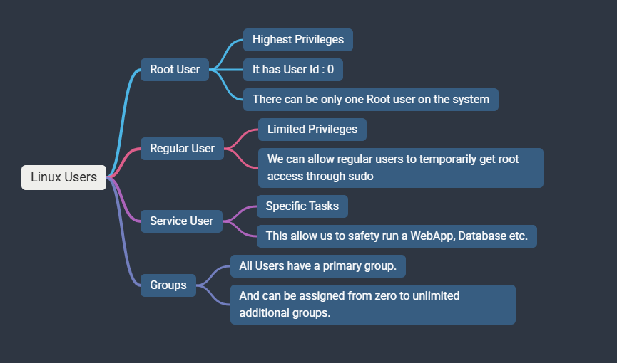

### Managing Users

#### On Linux, user information is stored in various files:

- /etc/passwd:
- contains basic user account information
- Username, user ID (UID), group ID (GID), user description (full name), home directory and default shell.

### cat /etc/passwd

- The `main user or Administrator` is: `root user`:
- `root:x:0:0:root:/root:/bin/bash`
- 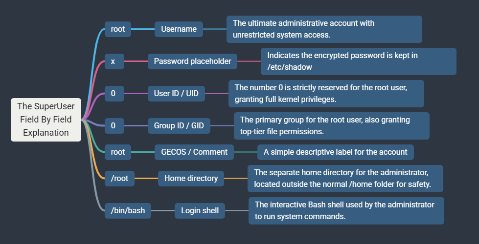

---

- The `Normal user` for example: `swami user`
- `swami:x:1000:1000:,,,:/home/swami:/bin/bash`
- 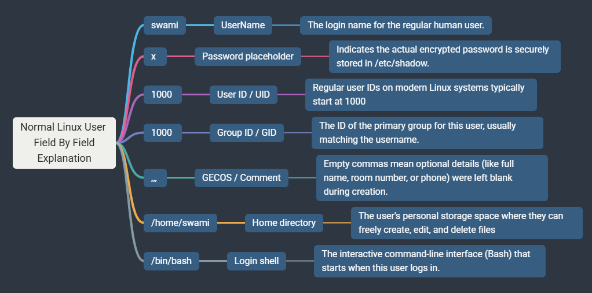

---

- The `Service User` for example: systemd
- `systemd-network:x:998:998:systemd Network Management:/:/usr/sbin/nologin`
- 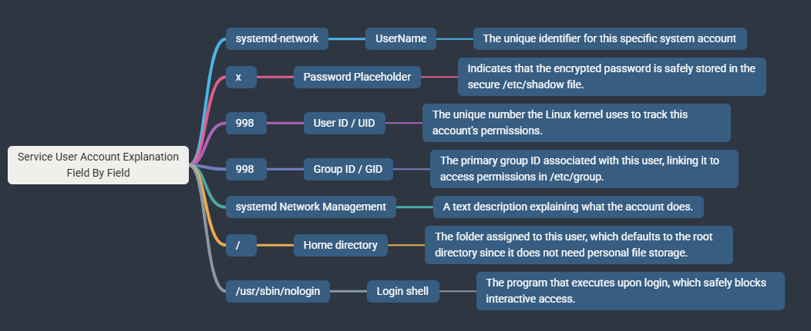

---

### cat /etc/shadow

- It stores encrypted user password and password aging information.
- Also stores additional information, such as the date of the last password change, expiry dates, etc.
- Readable only by the root users (or users with root privileges).
- `cat: /etc/shadow: Permission denied` when normal user tries to `access` with it.
  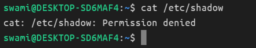
- The primary user who is having 1000 uid may have access to it but that user need to put the password too for accessing this file.
- 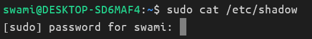
- 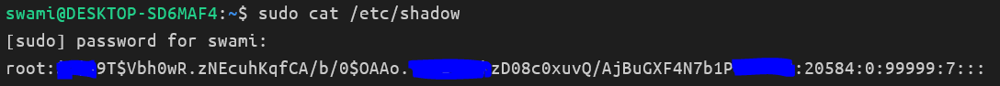
- 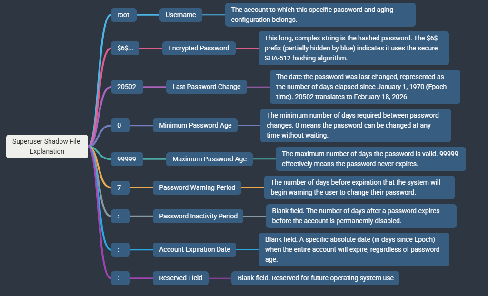

---

### cat /etc/group

- Contains the information about the groups, and their members.
- Readable by all users.

### `group_name : password_placeholder : group_id (GID) : user_list`

For example:

1. `adm:x:4:syslog,swami`

- 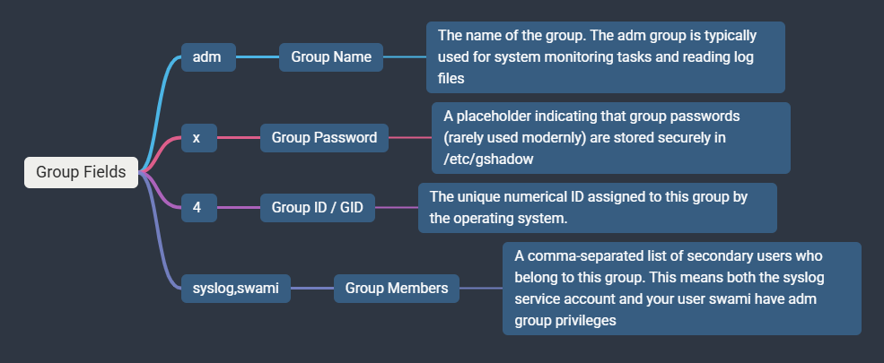

---

2. `root:x:0:` : The administrative superuser group (GID 0). It has no explicit users listed because root automatically belongs to it as its primary group.
3. `daemon:x:1:` : A system group (GID 1) used by background processes that don't need full root privileges.
4. `bin:x:2:` : A legacy system group (GID 2) historically used to manage ownership of system executables.
5. `sys:x:3:` : A system group (GID 3) traditionally used to grant access to specific system utilities or raw kernel information.

---

## CREATING AND SECURING NEW USERS: `useradd & passwd`

### Adding a new user

- with `useradd` command we can create new users.
  - `Syntax : useradd [options] username
  - The most important options are:
  - `-m` : creates a home directory
  - `-d` : custom home directory
  - `-s` : special default shell
  - `manage groups` : user should have the groups or the user belongs to the group.
  - `-g` : Specify the primary group instead of using the default configuration.
  - `-G` : add user to a secondary groups

Example: `useradd -m -d /home/lauren lauren`

### Note: Normal user cannot directly create the user. He needs `sudo permissions` to do it so.

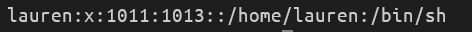

#### Note: Here for the user `lauren` the new group has been created with the number `1013`, it is a default group creation by the lot of Linux distributions.

#### Now check for the `lauren` user password: sudo cat /etc/passwd

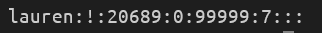

- If you create any new user then `default` password not been created.
- The exclamation `!` mark: the `password is not set`.
- The `*` mark: The `no-login` user.
- Home directory check: 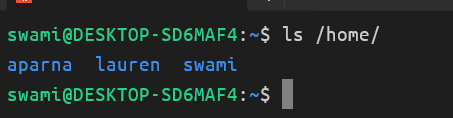
- We still can't login to `lauren` user as password is not set yet.
- Proof: 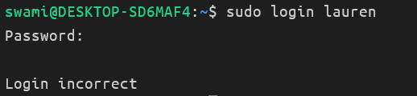

---

### Managing the User's Password

- With a passwd command, we can set the password for the users.
  - Syntax: `passwd [options] [username]`
  - The most important options are:
  - `-S` : Display password status
  - `-d` : Delete password
  - `-n` : Set the minimum password age (days).
  - `-x` : Set the maximum password age (days).
  - `-l` : lock the user account.
  - `-u` : unlock the user account.

Experimentation:

Display: 

The line `swami P 2026-04-05 0 99999 7 -1` contains seven specific fields of information:

- `swami (User Name)`: The login name of the account being checked.
- `P (Password Status)`: Indicates a usable password. Other possible letters include L for locked or NP for no password.
- `2026-04-05 (Last Change)`: The exact date when the password was last modified.
- `0 (Minimum Age)`: The minimum number of days required before the user can change their password again. Zero means it can be changed at any time.
- `99999 (Maximum Age)`: The maximum number of days the password is valid. 99999 effectively means it is set to never expire.
- `7 (Warning Period)`: The number of days before expiration that the user will start receiving warning messages to change their password.
- `-1 (Inactivity Period)`: The number of days after a password expires before the account is permanently disabled. A value of -1 means the account will never be disabled due to an expired password.

---

### See the difference between Locked and Unlocked User.

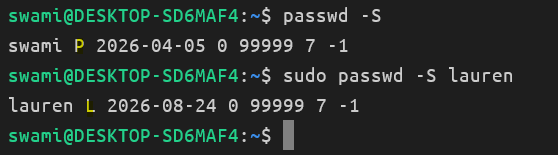

- The `swami user` has been created and has a password.
- The `lauren user` created but locked.

### The password created for the user `lauren`

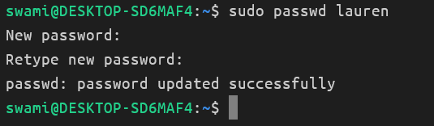

---

### Now logged in into `lauren's` account with password:

- sudo login lauren
- 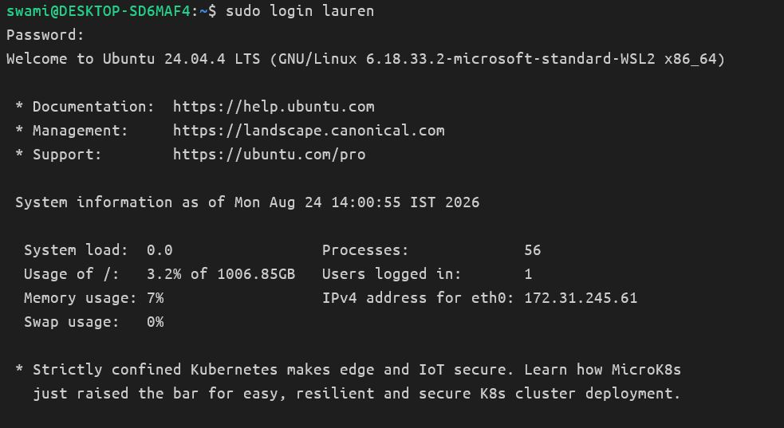

### How to handle the password expiration

> `sudo passwd -n 7 -x 30 lauren`

- Lauren should change her password after every 30 days and her minimum password age is 7 days.

---

### Changing user options: the command `usermod`

- We can modify the other users details.

> usermod [options] username

- the most important options are:
- `-c` : change user description (user full name)
- `-s` : default shell
- `-d` : change the home directory (-m also move the existing home directory to new location)
- `-l` : change username
- We can also modify the user's group
- `-g` : change the primary group
- `-G` : change the secondary group
- `-aG` : add the secondary group

### Exmaple: Change the Lauren user default shell form sh to bash and change the description or name as 'Lauren H.'

> `sudo usermod -s /bin/bash -c 'Lauren H.' lauren`

#### The lauren used no logged in with bash shell see the below outputs

> 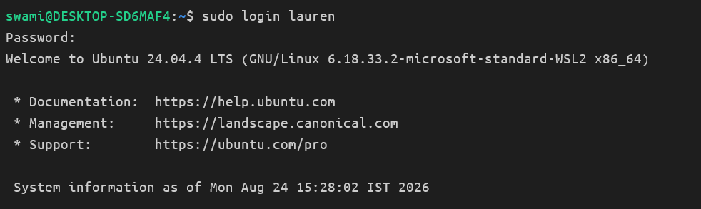
> 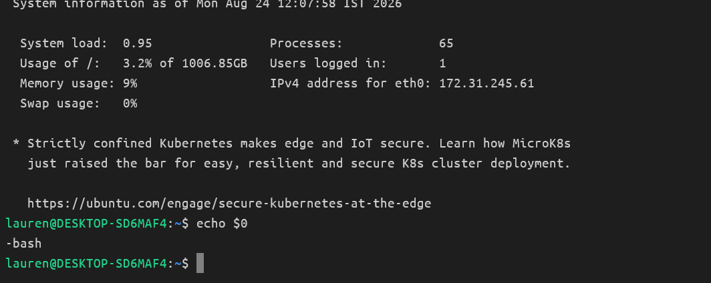

### Add user `lauren` to secondary group `docker`

> `sudo usermod -aG docker lauren`

- Check user `lauren` added to docker group or not.
- 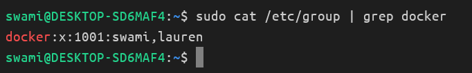

---

### Deleting users with `userdel` command

> userdel [options] username

Example:

> userdel max

#### There are few options

- `-r`: removes the home directory + mails
- `-f`: also moves home directory + mails, forces the removal of the user, even if the user still logged in.
- Might also delete a group with the same as this user.
  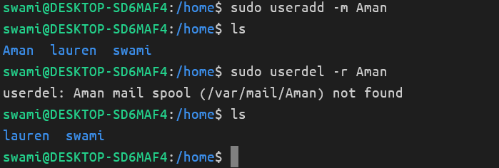

---

## How Group Works on the Linux Systems?

### Why we do need groups on Linux Systems?

#### `They help us with` :

- Organizing users with similar access rights.
- Simplifying permission management.
- Enhancing collaboration and resource sharing.
- Controlling access to files and directories.
- Strengthening system security.

### How do Group Work?

- Each user has a primary group and zero to many secondary groups.
- Primary Group:
  - Stored in /etc/passwd
  - Default ownership for new files.
- We can test this:
- touch file.txt
- ls -al file.txt

---

### Primary Group Example `Associated With the User`

- Suppose I logged in with the created user `lauren`.
- When we crate any new user the system will assign a default group to every user.
- > cat /etc/passwd
- > 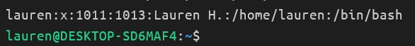

Here see that lauren has UID = 1011 and GUID = 1013

- Now, we will see how it has been managed inside the group folder.
- > cat /etc/group
- > 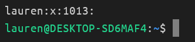
- that is inside the group folder the 1013 belongs to `lauren` (own ownership group)
- And hence whenever we create any resource inside the user account that automatically belongs to respected user and group.
- For example:
- > 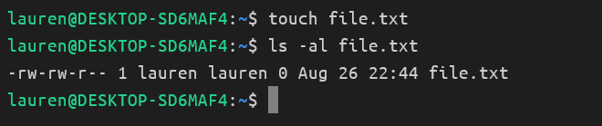
- Here, the file has been created inside the `lauren` home directory.
- The file (resource) belongs to `lauren's` group. UID = lauren, GUID = lauren.
- This is the concept of Primary Group.

---

### The Concept of Secondary Group

- Multiple membership allowed.
- Stored in /etc/group
- This allows us to give this user fine-grained access rights to our system.
- > 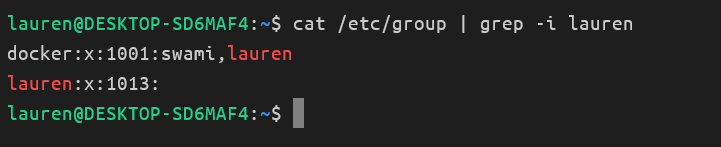
- See here, the user `lauren` belongs to the secondary group called `docker`.
- We can list a user's group by the following command:
- groups [username]
- 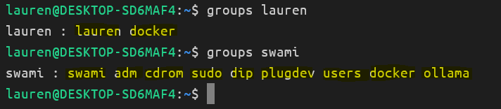
- See here, the lauren belongs to two groups: `primary: lauren` and `secondary: docker`.
- The user swami belongs to many secondary groups: `primary: swami` and `secondary: adm cdrom sudo dip plugdev users docker and ollama`.
- > 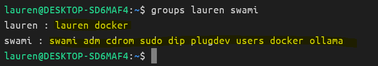

---

## `Existing groups in Ubuntu`

- There are quite a few existing group in Ubuntu.
- A selection of the most important groups:
  - 1. `root` : The superuser group with administrative privileges, allowing complete control over the system.
  - 2. `sudo` / `wheel`: Members can use `sudo`. May also be called `wheel`.
  - 3. `adm` : Allows members to read log files. (tail /var/log/syslog)
  - > 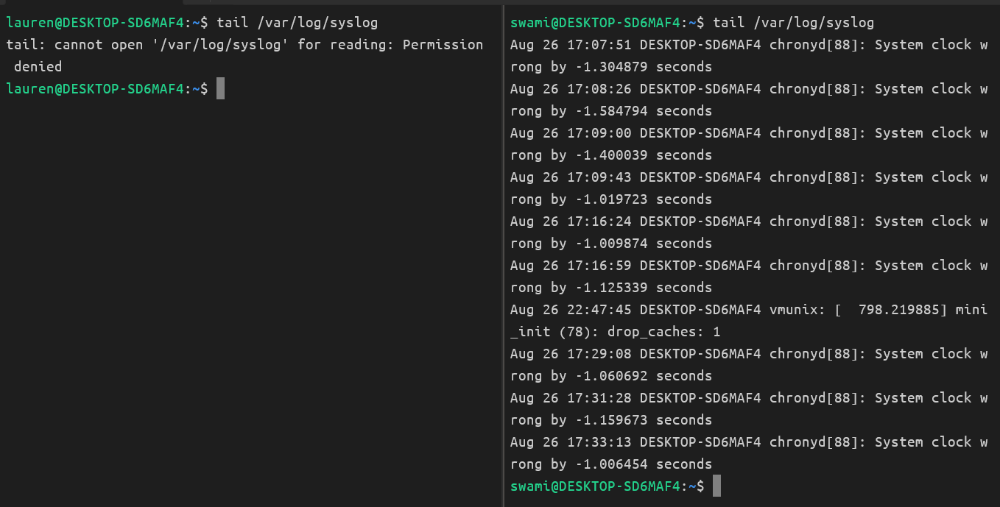
  - > see the difference here as `lauren user does not belongs to adm` group and `swami user belongs to adm group and allowed for the syslogs`.
  - 4. `lpadmin` : Allows members may manage printers and printers queue. May also be called `lp`
  - 5. `www-data` : A group for web-server processes (such as Apache or Nginx), gives access to web content.
  - 6. `plugdev` : Allows this user to manage pluggable devices (USB disks, external HDDs)
