# Kernel vs Distribution vs WSL2

## 1. Linux Kernel:

- The brain of the OS
- It manages CPU, memory, devices, networking.
- It's just a program.

## 2. Distribution (Ubuntu):

- Kernel + All User tools (like shell, package manager, systemd). Companies standardize on Ubuntu LTS because it's stable for 5 Years.

## 3. WSL2

- A real linux kernel running inside a light weight VM on windows. It is extremely close to a real cloud VM.

---

## Three ways to see the System Info.

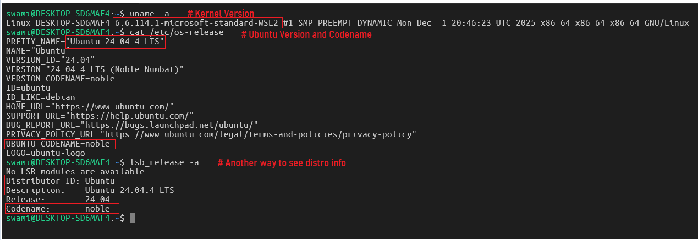

---

### Production rule: No mouse. No GUI. No Windows File Explorer for anything inside Linux.

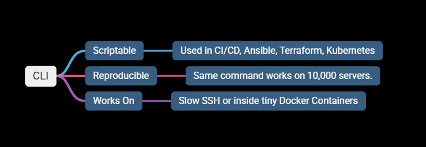

---

## 3. Core Commands you will use every single day

### 3.1 PWD (Print Working Directory)

Syntax : > pwd

Why : > You SSH into a server 3:00 AM - first command you run

Production Use : > Always know where you are.

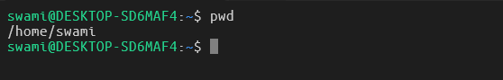

---

### 3.2 ls (List (the #1 command in Linux history)

- long format (permissions, owner, size, date)
  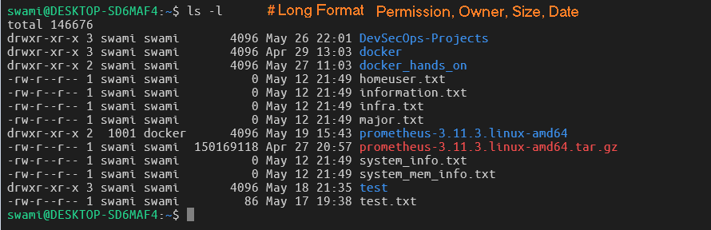

- show hidden files (dot files)
  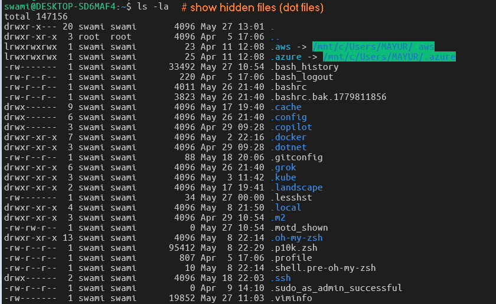

- human-readable sizes (K, M, G) ← use this in prod
  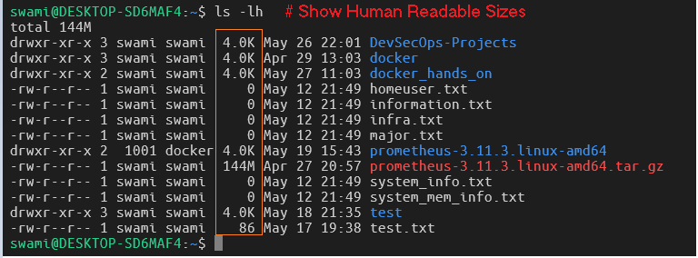

- sort by size (largest first)
  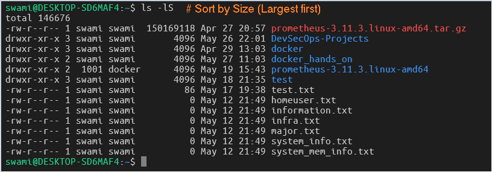

- sort by modification time (newest first)
  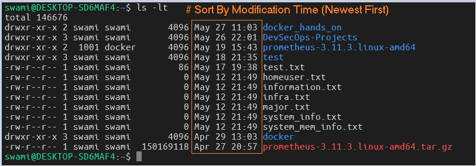

- combination you will type 1000 times in your career
  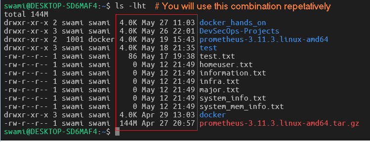

---

## 4. CD (Change Directory)

- First moved to /etc folder, and then come back to home directory.
  

#### Pro tip: Tab completion is your superpower. Type cd /et → press Tab twice → see options.

- Back to previous directory (super useful!) (How to Go Previous one)
  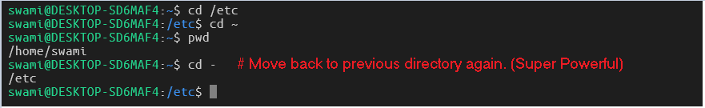

- Up One Level
  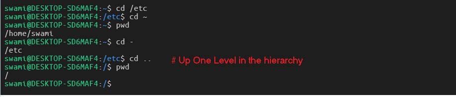

- Up Two Level
  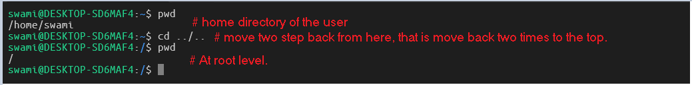

---

## 5. Install two tools every senior engineer uses daily:

> sudo apt update && sudo apt install -y tree tldr bat

#### Now try,

> tree -L 2 ~

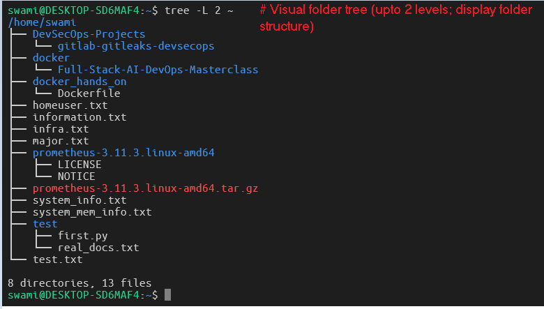

#### practical examples instead of man pages

> tldr ls

---

### Hands On

- Task 1

- > mkdir -p ~/linux-mentorship/phase1
- > cd ~/linux-mentorship/phase1
- > pwd # confirm location
- > ls -la

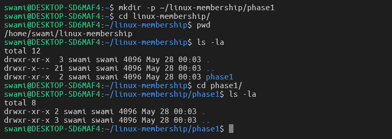

- Task 2 (Create First Linux Journal)

- > echo "Phase 1 Day 1 $(date)" > journal.md
- > bat journal.md

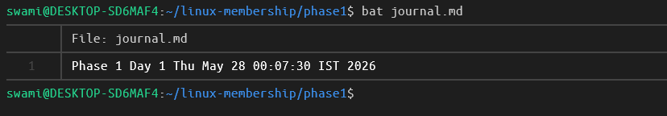

#### Note: Here, I faced a problem that bat was installed in my machine.

- I installed bat by using the following command.

  > sudo apt install bat

- It’s a very common Ubuntu package conflict that happens to almost everyone on Ubuntu 24.04 (which you are running).

#### Here’s exactly what happened:

- When we ran sudo apt install -y ... bat, Ubuntu installed Bacula’s BAT (a backup administration tool).
- The tool we actually wanted is the modern bat (the cat replacement with syntax highlighting by sharkdp).
- On Debian/Ubuntu, the modern bat binary is deliberately installed as batcat (not bat) to avoid conflicting with the older Bacula tool.

- That’s why bat journal.md showed the long “Usage: bat ...” help text and the copyright for Kern Sibbald (Bacula) instead of showing your journal file.

#### How that has been Debugged

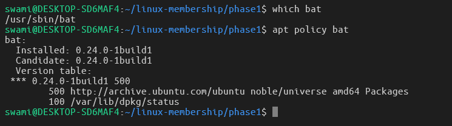

#### How it was fixed permenantly?

#### Added alias so `bat` always means the nice cat clone

- > echo 'alias bat="batcat"' >> ~/.bashrc
- > source ~/.bashrc

#### And then it has been tested with following command.

> bat journal.md

---

##### More Detail Journaling

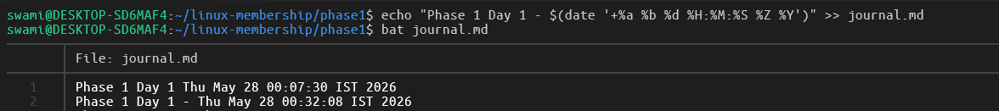
