# Objective

- Master command history (never type the same command twice)
- Know the keyboard shortcuts that make you 3x faster in the terminal
- Understand aliases and how we customize our shell permanently
- Internalize the single most important Linux philosophy: “Everything is a file”
- Learn the next batch of must-know commands safely (with production rules)

---

# 1. Command History Mastery (you will use this every single day)

- > show last `1000` commands (default)
- > $ `history`
  > 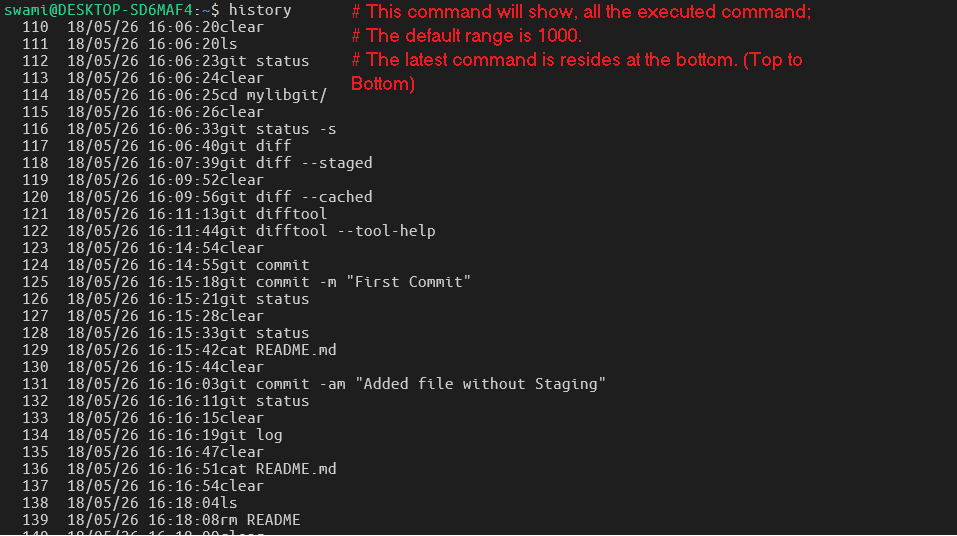

- > to show last `20` commands
- > $ `history | tail -20`
  > 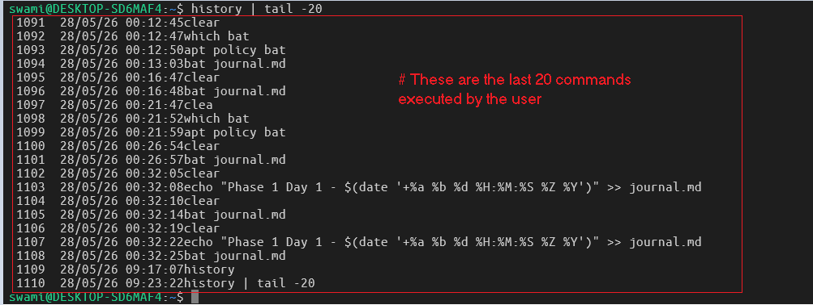

- > search for previous `apt` commands
- > $ `history | grep apt`
  > 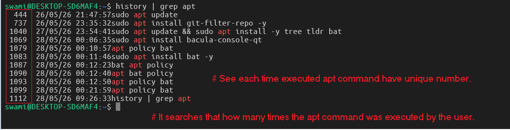

- > re-run command number 123
- > $ `!123`
  > 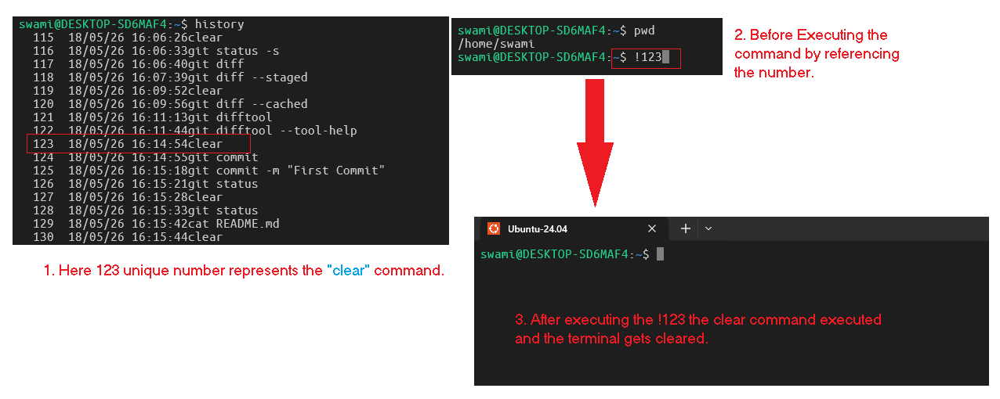

- > last argument of previous command
  > 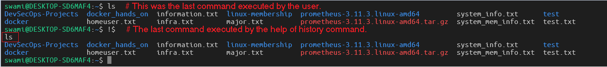

- > incremental reverse search (type part of command → press Ctrl+R again to cycle)
- > press `ctrl + R`
- > After pressing `ctrl + R` and searched for the `apt` command.
  > 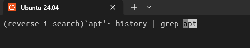
  > Production use case: You just ran a long docker logs command on a Kubernetes node. You need to run it again with a different container ID → just press `Ctrl+R` and type `docker logs`.

---

### Pro tip: Add this to your ~/.bashrc so history is bigger and saved across sessions:

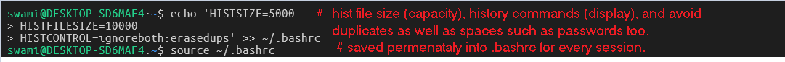

### 2. Terminal Keyboard Shortcuts (senior engineer superpowers)

| Shortcut  | What it does                            | Production Example     |
| --------- | --------------------------------------- | ---------------------- |
| Ctrl + C  | Kill current command                    | Stop a hanging process |
| Ctrl + Z  | Suspend current command (bg/fg later)   | Pause long job         |
| Ctrl + D  | Logout / End of file                    | Exit SSH session       |
| Ctrl + L  | Clear screen (same as clear)            | Clean view             |
| Ctrl + A  | Jump to beginning of line               | Edit long command      |
| Ctrl + E  | Jump to end of line                     | Edit long command      |
| Ctrl + U  | Delete from cursor to beginning         | Wipe bad command       |
| Ctrl + K  | Delete from cursor to end               | Wipe bad command       |
| Ctrl + W  | Delete previous word                    | Fix typo fast          |
| Ctrl + R  | Search history (already covered)        | Most used shortcut     |
| Ctrl + XX | Toggle between cursor and start of line | Quick editing          |

### 3. Aliases Deep Dive (make the terminal yours)

- > Run these (they go into ~/.bashrc):
  > 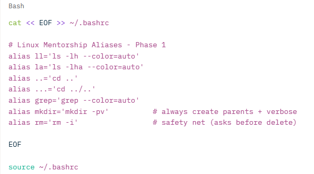

#### Now Test Alias:

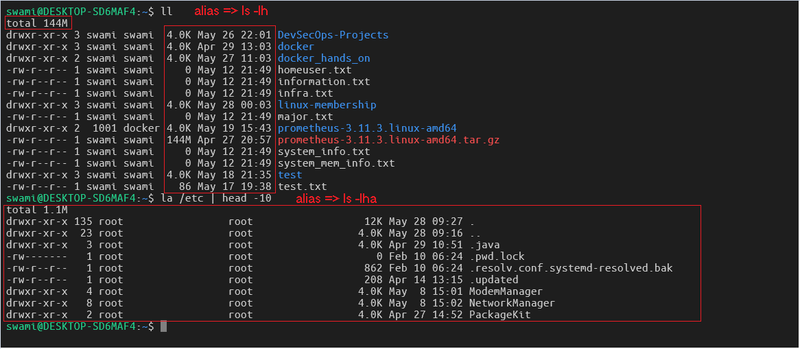

---

### 4. Everything is a File Philosophy (the Linux Mindset)

- This is the single most important concept in Linux.
  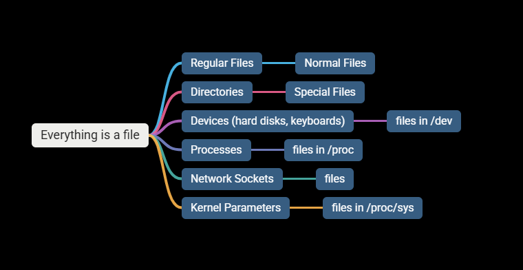

- Examples

- 1. See your CPU as a file
     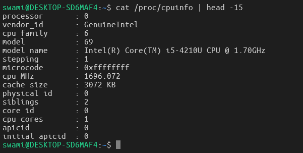
- 2. Your disks are also files
     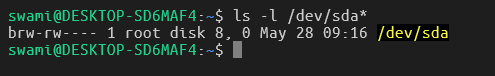
- 3. Kernel version as a file
     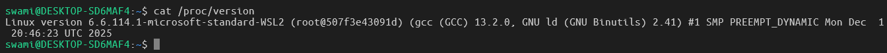

#### Real-world connection:

- In Kubernetes, when you exec into a pod, you treat logs, configs, and devices exactly the same way.

---

### 5. Must know commands (with production safety)

#### 5.1 (cat,less,haid,tail,wc) for text viewing

1. - > `cat` command mostly used for any data reading operations.
   - > $ cat journal.md
   - > 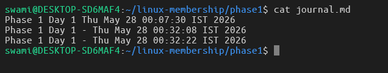

2. - > `less` command the scrollable and easy to manipulate for reading.
   - > $ less journal.md
   - > 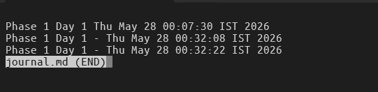

3. - > `head` command can used to read from file but non-scrollable.
   - > $ head -10 /var/log/dpkg.log
   - > 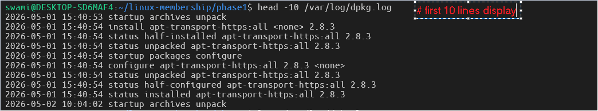

4. - > `tail` command has an option to show the live logs by using `-f` flag.
   - > $ tail -f /var/log/syslog
     > 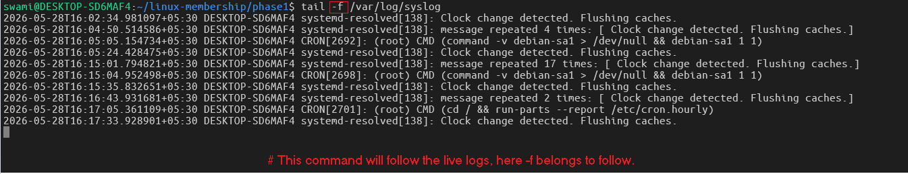

5. - > `wc` command for counting lines, words and characters from specific data.
   - > $ wc -l journal.md
   - > $ wc -c journal.md
   - > $ wc -w journal.md
   - > 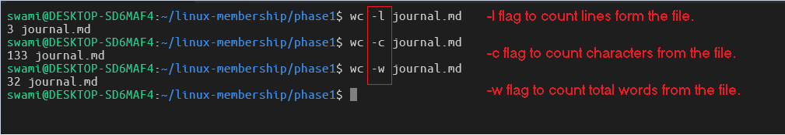

---

### 6. touch/mkdir/cp/mv/rm (file operations)

1. - > `touch` command is used for creating empty file or update timestamp
   - > $ touch test.txt
   - > 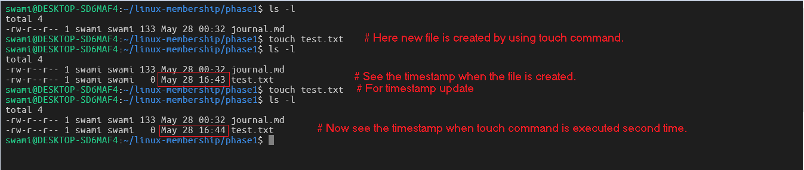

2. - > `mkdir -p` command will create parent folder as well as if folder is already present then there would be no error.
   - > $ mkdir -p backup/2026
   - > 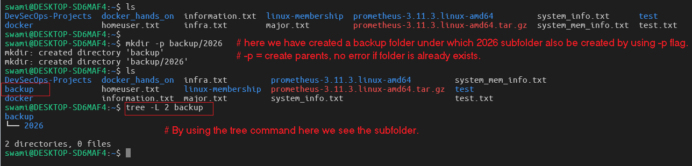

3. - > `cp` command will copy the file from source to destination.
   - > $ cp journal.md backup/
   - > 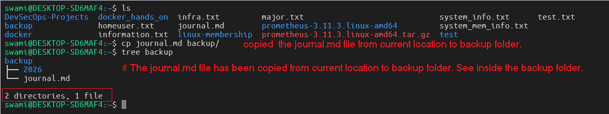

4. - > `mv` command is use generally for the file movement and renaming operations.
   - > $ mv journal.md backup/journal1-day1.md
   - > 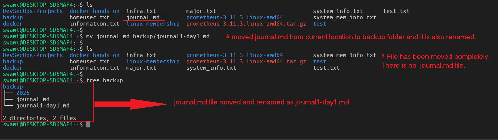

5. - > `rm -i` command is use generally for the file deletion with interactive mode.
   - > $ rm -i test.txt
   - > 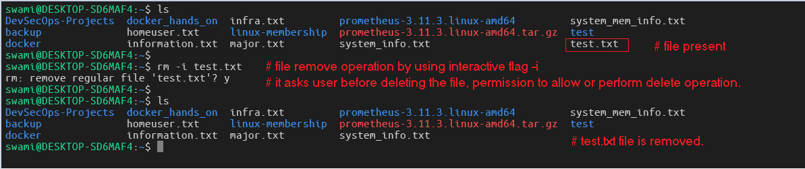

### Production Safety Rule:

#### Never run rm -rf /something without thinking twice.

#### We use rm -i by default and rm -rf only when 100% sure (or after ls first).

---

### Hands On

#### Task 1: Update your journal with today’s learning

- > cd ~/linux-mentorship/phase1
- > echo "Phase 1 Day 2 - $(date '+%a %b %d %H:%M:%S %Z %Y') - History, shortcuts, aliases, everything-is-a-file" >> journal.md
- > bat journal.md
- > 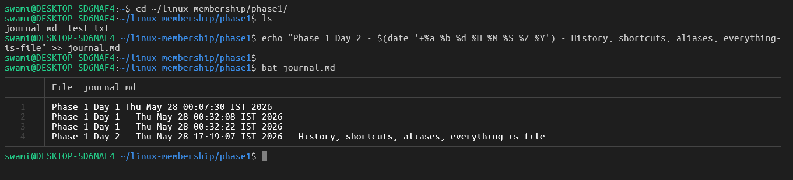

---

#### Task 2: Practice history & shortcuts:

- Run 5 different commands
- Use Ctrl+R to re-run one of them
- Use !! and !$
  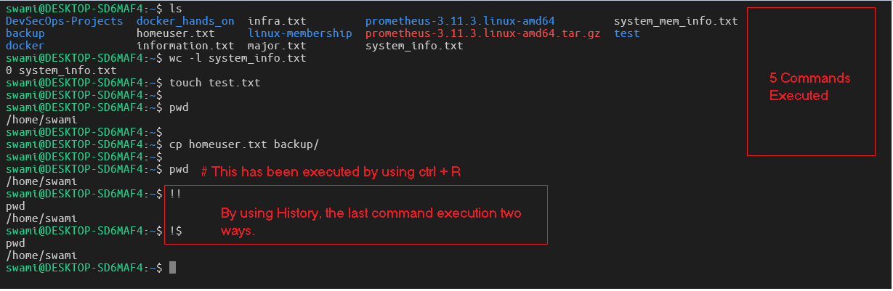

---

#### Task 3: Create a small test structure.

- > mkdir -p practice/{logs,configs,scripts}
- > touch practice/logs/app.log practice/configs/nginx.conf
- > ls -la practice
- > 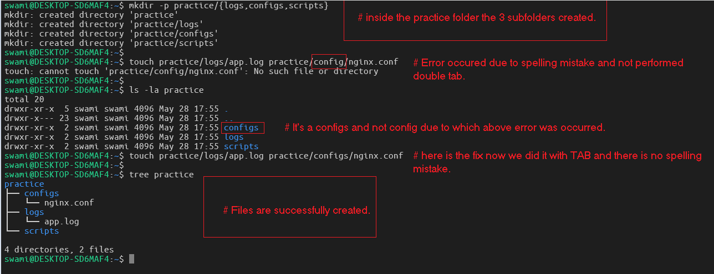

#### Task 4:

- > ls -l /proc/$$
- > it does not show any $$ = current shell process ID.
- > why => $$ is a special Bash variable. It always expands to the Process ID (PID) of your current shell.
- > When you type : ls -l /proc/$$
- > Bash first replaces $$ with your actual PID number (in your case it was something like `12345` or whatever your shell’s PID was at that moment).
- > Therefore the command becomes: ls -l /proc/12345
- > This is the “Everything is a file” philosophy in action.
- > 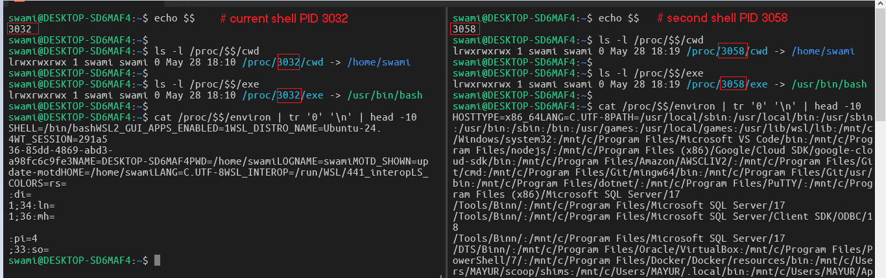

#### In same Task 4, the second command.

- > $ cat /proc/loadavg
- > 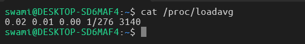

- What you are looking at:
  0.02 0.01 0.00 1/276 3140

---

| Field                      | Value | Meaning                                                                                         |
| -------------------------- | ----- | ----------------------------------------------------------------------------------------------- |
| 1-minute load average      | 0.02  | Average number of processes that were ready to run or waiting for I/O in the last 1 minute      |
| 5-minute load average      | 0.01  | Same as above, but averaged over the last 5 minutes                                             |
| 15-minute load average     | 0.00  | Same as above, but over the last 15 minutes                                                     |
| Runnable / Total processes | 1/276 | Currently 1 process is runnable (ready to run) out of 276 total processes/threads on the system |
| Last process ID            | 3140  | The PID of the most recently created process on this system                                     |

---

#### Real-world relevance (why this matters in industry)

- Load average is one of the first things you check when a server feels slow.
- In production (especially Kubernetes nodes, Docker hosts, cloud VMs), you set alerts like: “Alert if 15-min load > number of CPU cores”
- A load average of < 1.0 on a single-core system = very idle (like your WSL2 right now).
- On a 16-core production server, a load of 12.0 is healthy, 25.0 is under heavy load, 40.0 is in trouble.
- Tools like `top`, `htop`, `Prometheus node_exporter`, and `Kubernetes` use this exact file under the hood.

---

#### Troubleshooting Exercise

- > rm -f nonexistent.txt

- Then fix the “No such file” error using only commands/shortcuts from Day 1 & 2.
  (Hint: history + !! + ls will help you think like an engineer.)

- > 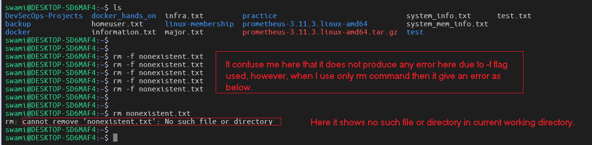

---

#### Doubt: Why rm -f nonexistent.txt is silent, but rm nonexistent.txt gives an error

| Command               | What happens when file does not exist                        | Why                    |
| --------------------- | ------------------------------------------------------------ | ---------------------- |
| rm nonexistent.txt    | Shows error: rm: cannot remove ... No such file or directory | Default behavior of rm |
| rm -f nonexistent.txt | Completely silent (no error, no output)                      | -f = force             |

#### What the -f flag actually does:

- Force removal if the file exists
- Silently ignore if the file does not exist (no error)
- Never prompt for confirmation (even if you have safety aliases)
- This is by design and is one of the most used flags in production.

#### Why does this matter in real industry work?

- In scripts and automation (Bash, CI/CD, Ansible, Dockerfiles), you often clean up temporary files.
- You don’t want your script to fail with an error just because a temp file was already deleted by something else.

> rm -f /tmp/myapp.pid /var/log/old.log # safe cleanup

#### The -f flag always overrides -i.

- So when you type rm -f, the alias is ignored and you get the raw force behavior.
- This is exactly why we use rm -f in scripts — we want force + silence.

#### Pro tip (production habit):

- Use plain rm or rm -i when you are manually deleting things.
- Use rm -f (or rm -rf very carefully) only in scripts/automation.

---
