# Navigate like senior engineer (this is a superpower)

- In production you will never have internet access when you need help. These are the tools we actually use:

| Command         | When to use                                  | Production Example |
| --------------- | -------------------------------------------- | ------------------ |
| command --help  | Quick one-line summary                       | ls --help          |
| man command     | Full manual (arrows to scroll, q to quit)    | man ls             |
| tldr command    | Practical examples (we installed this)       | tldr grep          |
| apropos keyword | Search all man pages for a topic             | apropos copy       |
| info command    | Alternative detailed docs (sometimes better) | info ls            |

#### Example

1. > ls --help 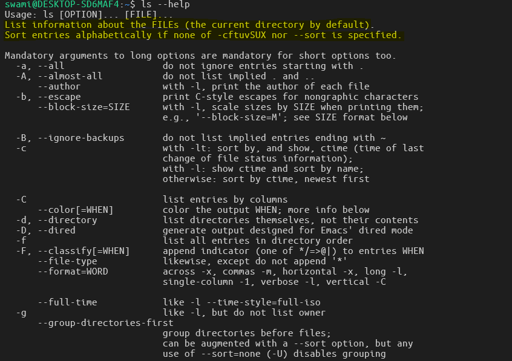

2. > man ls 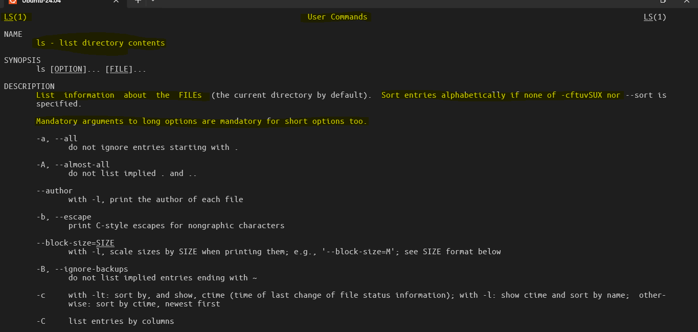

3. > tldr ls 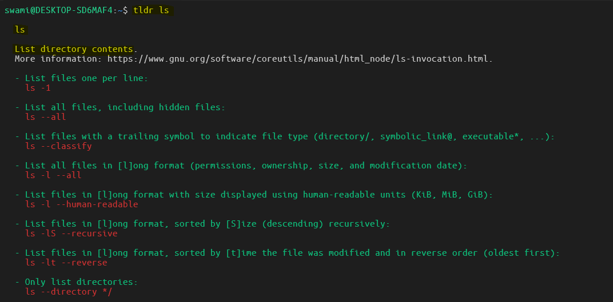

4. > apropos grep 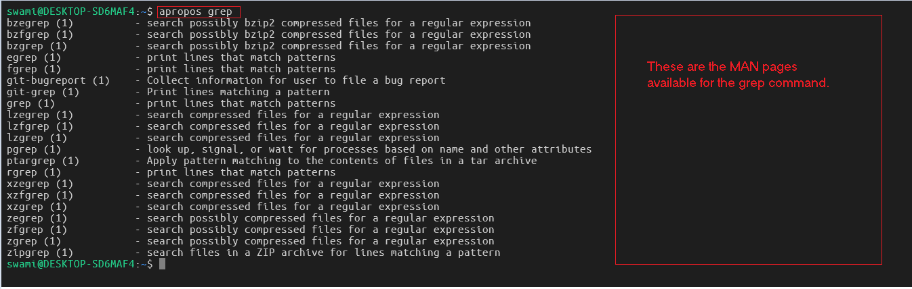

5. > info grep 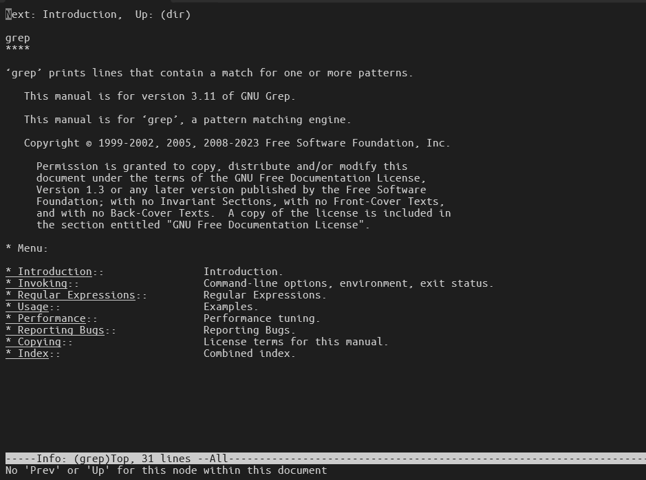

---

### Pro tip: Add below to your aliases today for easiness.

- echo "alias h='history | tail -30'" >> ~/.bashrc
- echo "alias ?='tldr'" >> ~/.bashrc
- source ~/.bashrc

#### Now you can type ? ls or h anytime.

---

### Finding things fast (the commands you will type 100 times a week)

1. > `which` shows full path of the real binary 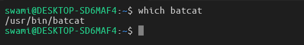
2. > `whereis` shows binary + man page + source 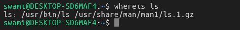
3. > `type` tells you if it's a built-in, alias, or binary 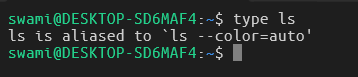
4. > `type -a` shows ALL versions (alias + binary) 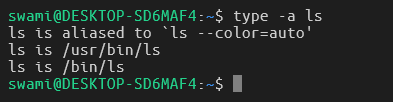

---

### Find Command : The Swiss Army Knief for searching files.

1. > find all markdown files in home (.md files) 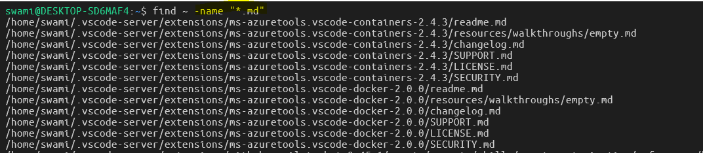
2. > only regular files containing "conf" 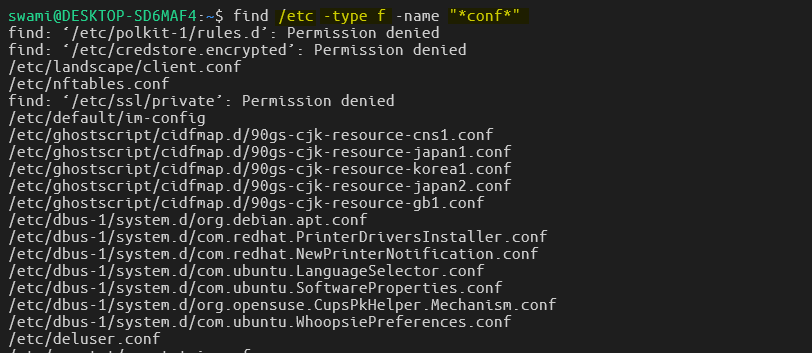
3. > files modified in last 24h 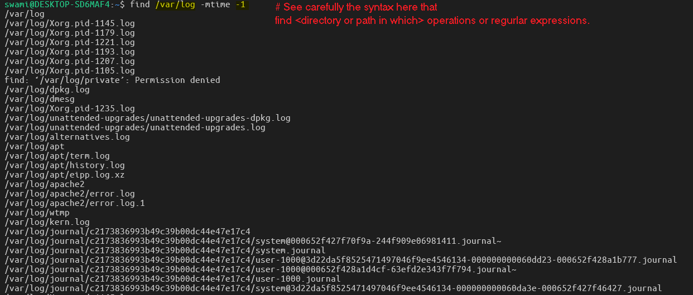
4. > files bigger than 10MB 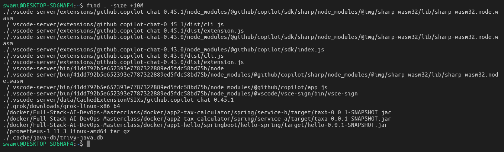
5. > ignore permission errors (common in prod) 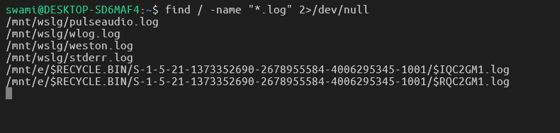

### grep – Search inside files (you will live in this command)

1. > basic search 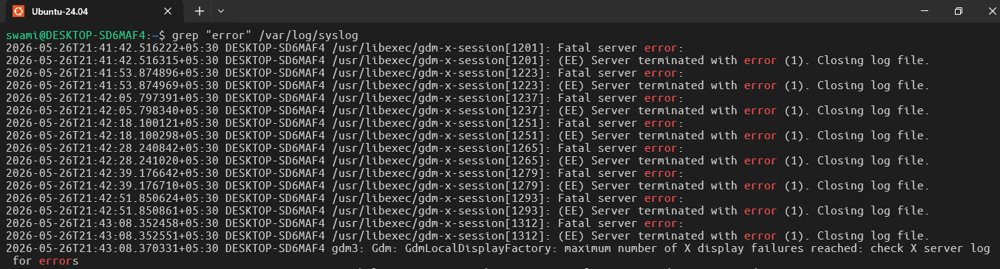
2. > recursive search in directory 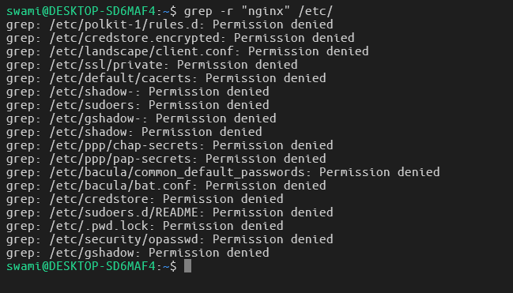
3. > case insensitive 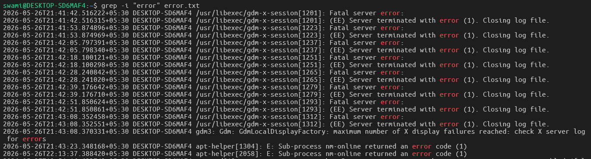
4. > show line numbers 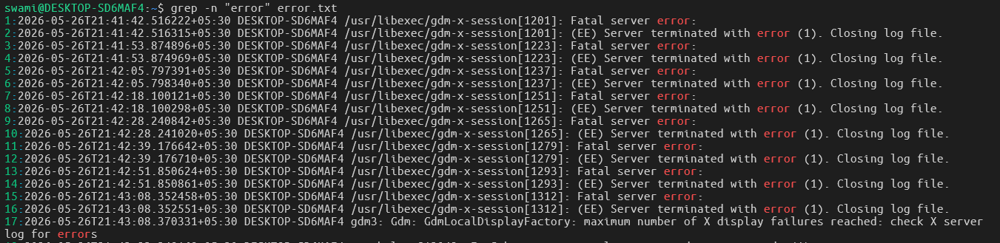
5. > multiple patterns (regex) 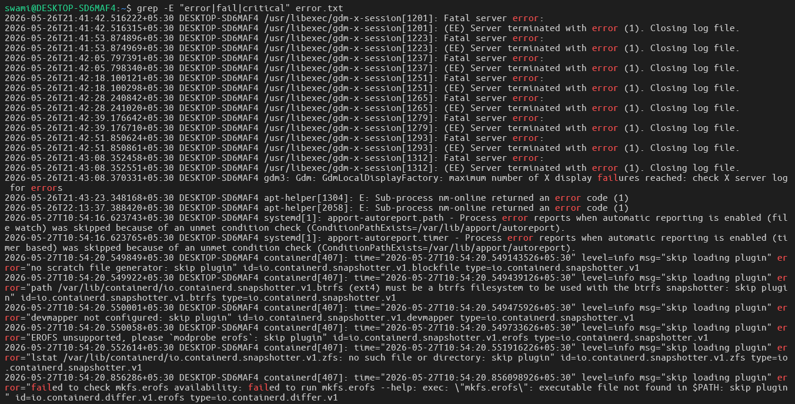

### `locate` superfast filename search (but it needs database.)

1. > First run one time > sudo updatedb
2. > `locate <file_name>` 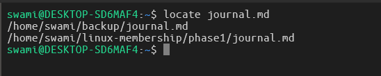

### Real-world connection:

In Kubernetes nodes or Docker hosts, you will constantly do:

1. > `find /var/lib/docker -name "*.log"`
2. > `grep -r "OOMKilled" /var/log/containers/`

---

### Hands On Task

##### Task 1

1. > Update your journal.md 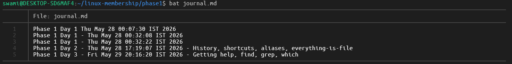
2. > `tldr find` 
3. > `man grep | head -30` 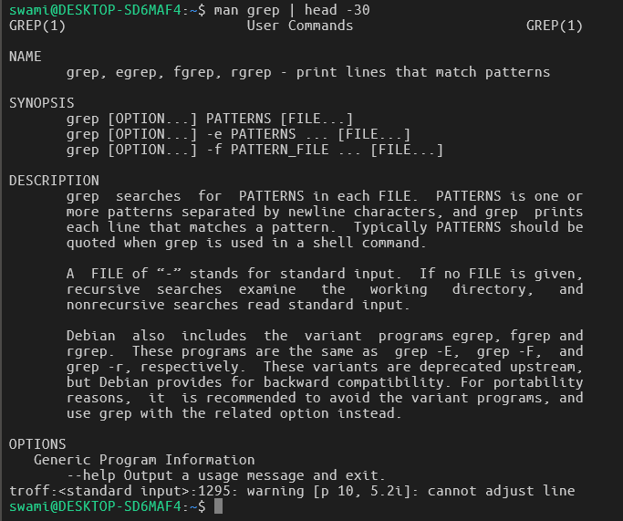
4. > `apropos search` 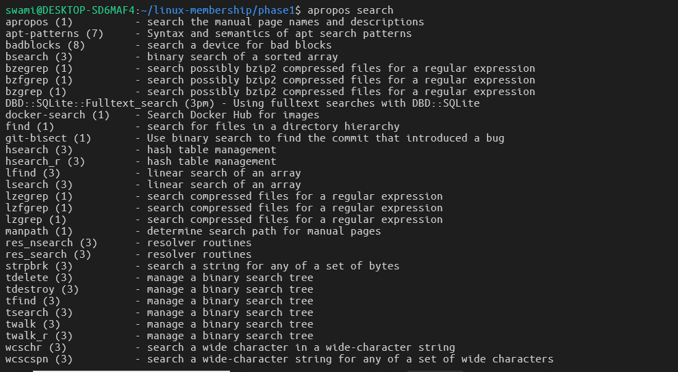

---

##### Task 2

1. > `cd ~/linux-mentorship/phase1`
2. > `mkdir -p search_lab/{logs,configs}` 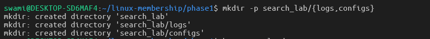
3. > `echo "ERROR: database connection failed" > search_lab/logs/app.log`
4. > `echo "server_name localhost;" > search_lab/configs/nginx.conf`
   > 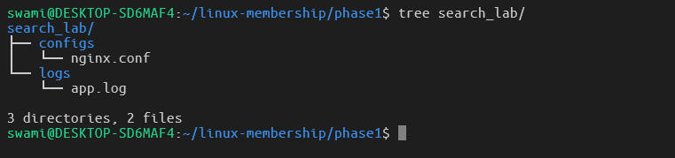

#### Task are as follows

1. > find full path of `tldr` command. 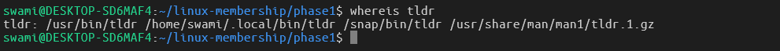
2. > find every file in search_lab folder that contains the word "ERROR". 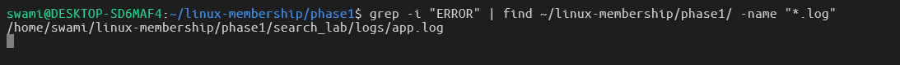
3. > find all `.conf` files in the entire /etc directory. 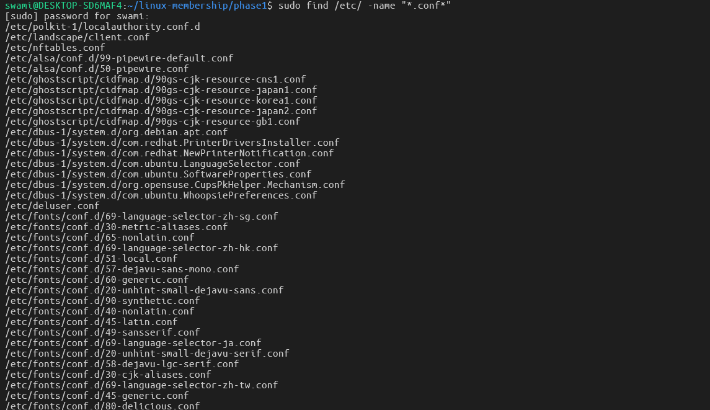

---

#### Troubleshooting Exercise (do this now)

1. > `grep "something" nonexistent-file.txt`
2. > You will get an error. Fix it using the commands from today (hint: 2>/dev/null or redirecting errors is a common production trick). 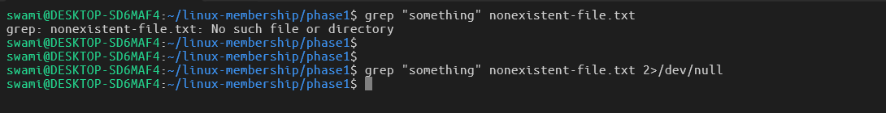

#### Final Task

1. > `which tldr`
2. > `find ~/linux-mentorship/phase1 -name "*.md"`
3. > `grep -r "Phase 1" ~/linux-mentorship/phase1/search_lab`
4. > `tree ~/linux-mentorship/phase1/search_lab`
5. > `bat journal.md`

> output 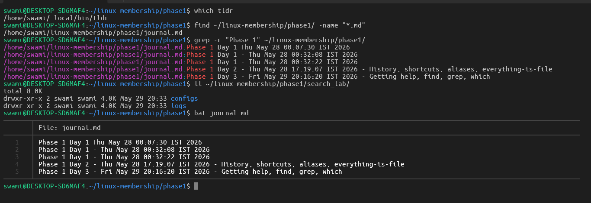

---
