# Objective: manipulating data efficiently

### 1. Redirection & Pipes (The Real Power of Linux)

1. > Overwrite file `command > file.txt` 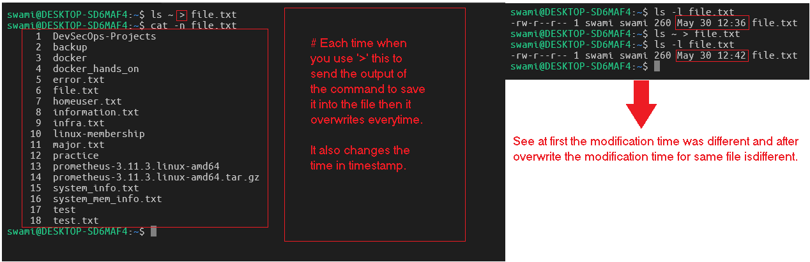
2. > Append to file `command >> file.txt` 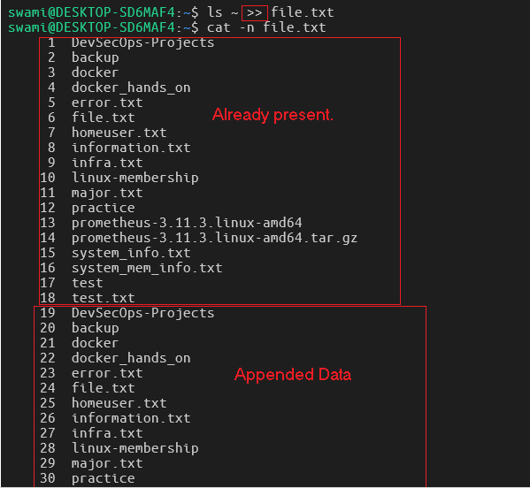
3. > Redirect only errors stderr `command 2> error.log` 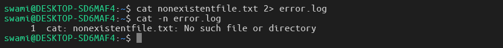
4. > For both output and errors `command &> all.log` 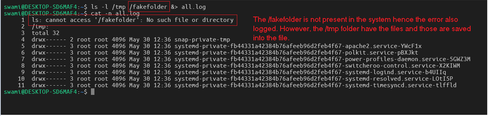
5. > Throw away all output commonly used in scripts. `command > /dev/null 2>&1` 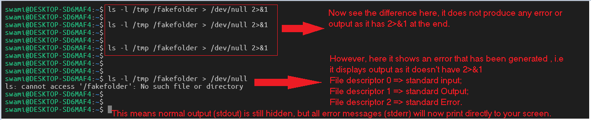

### Note: `2>&1` and `&>` are same, but they have different compatibility rules.

| Feature      | 2>&1                                                 | &>                                            |
| ------------ | ---------------------------------------------------- | --------------------------------------------- |
| What it does | Merges stream 2 into stream 1.                       | Merges both streams automatically.            |
| Syntax Style | Explicit and traditional.                            | Short and modern.                             |
| Portability  | Works in all Linux/Unix shells (sh, bash, zsh, ksh). | Works in Bash and Zsh, but fails in POSIX sh. |

### Pipes (): Pass output of one command as input to another.

1. > `ls -l | less` 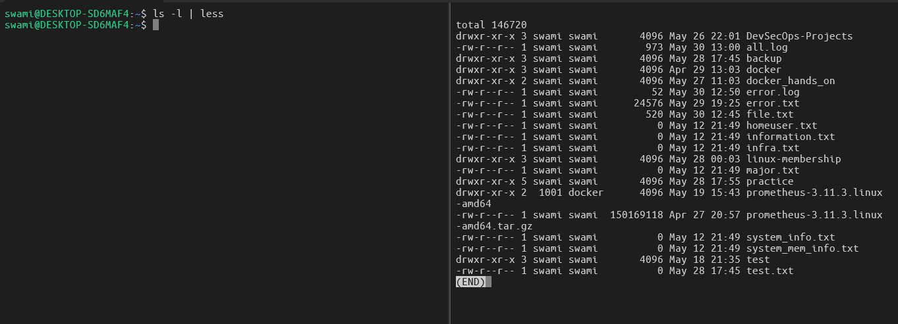
2. > `cat /var/log/syslog | grep "error"` 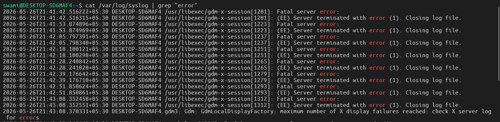
3. > `px aux | grep nginx` 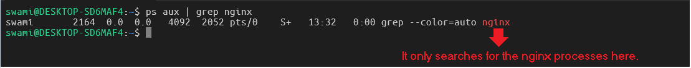

### tee: Split output (show on screen + save to file)

1. > see output + save to file `ls -l | tee listing.txt` 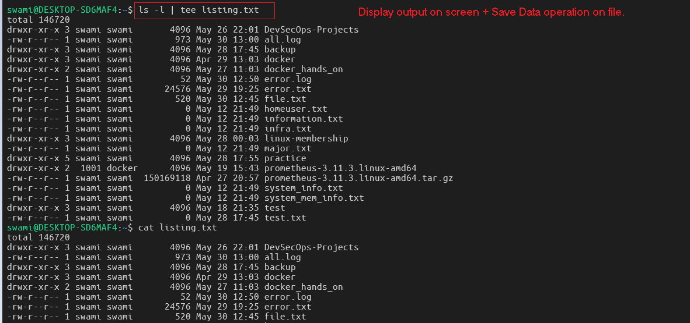
2. > append mode `ls -l | tee -a listing.txt` 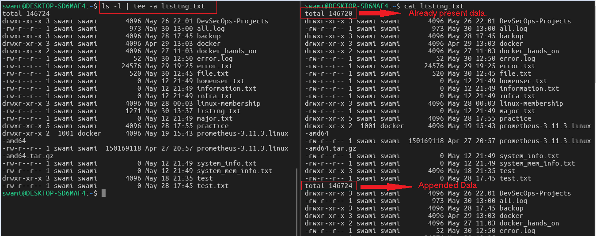

---

### Text Processing

1. > operational data saved into file. 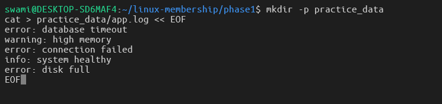
2. > operations with the commands. 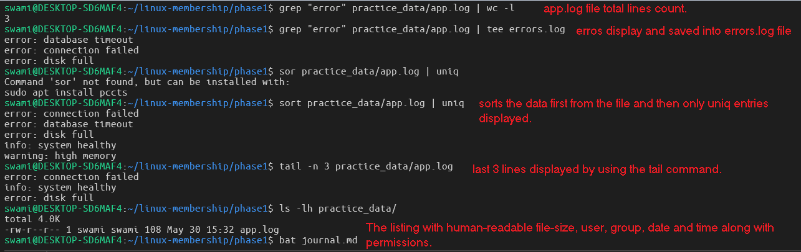

---

# Must-know commands

1. > copy recursively: `cp -r source dest` 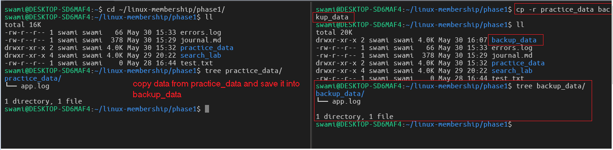
2. > for move/rename: `mv oldname newname` 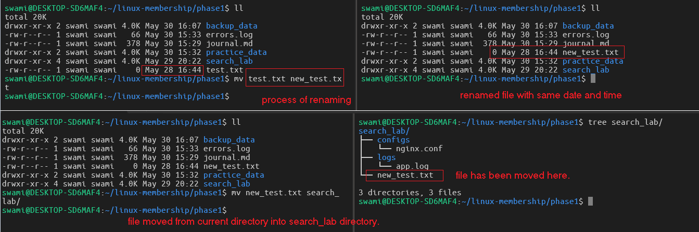
3. > careful! (use with caution): `rm -rf dir` 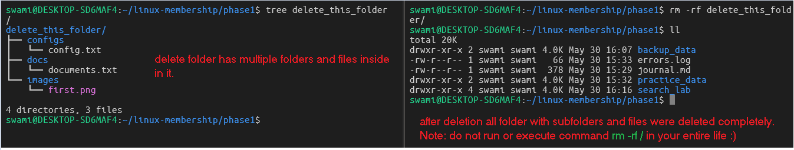
4. > create parent dirs: `mkdir -p`
5. > create/update file: `touch`
6. > disk usage (human readable): `df -h` 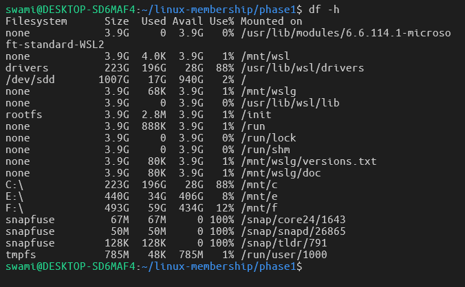
7. > directory sizes: `du -sh *` 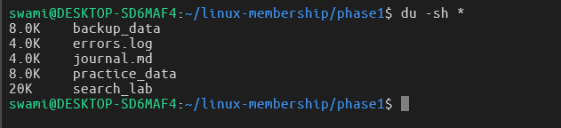
8. > memory usage: `free -h` 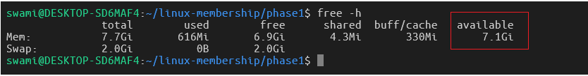
9. > `uptime` 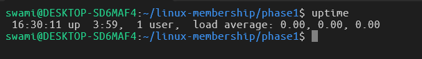
10. > `whoami` 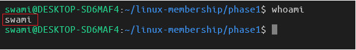
11. > `id` 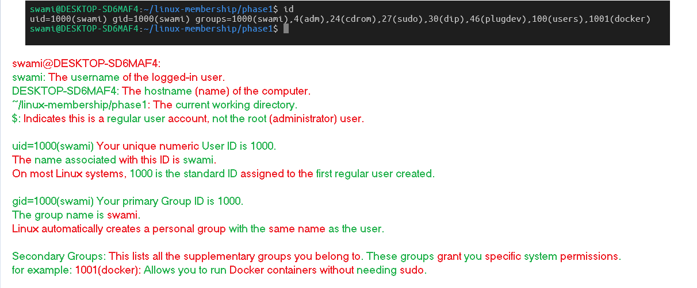
